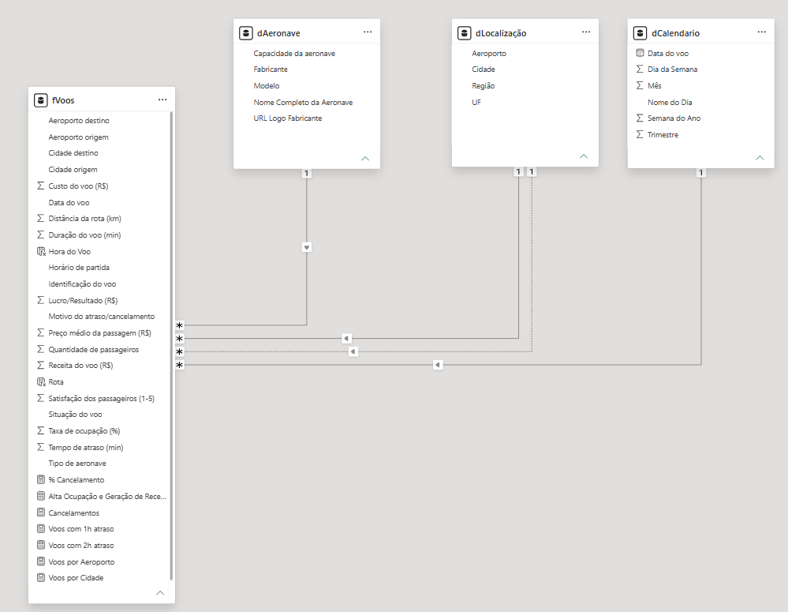
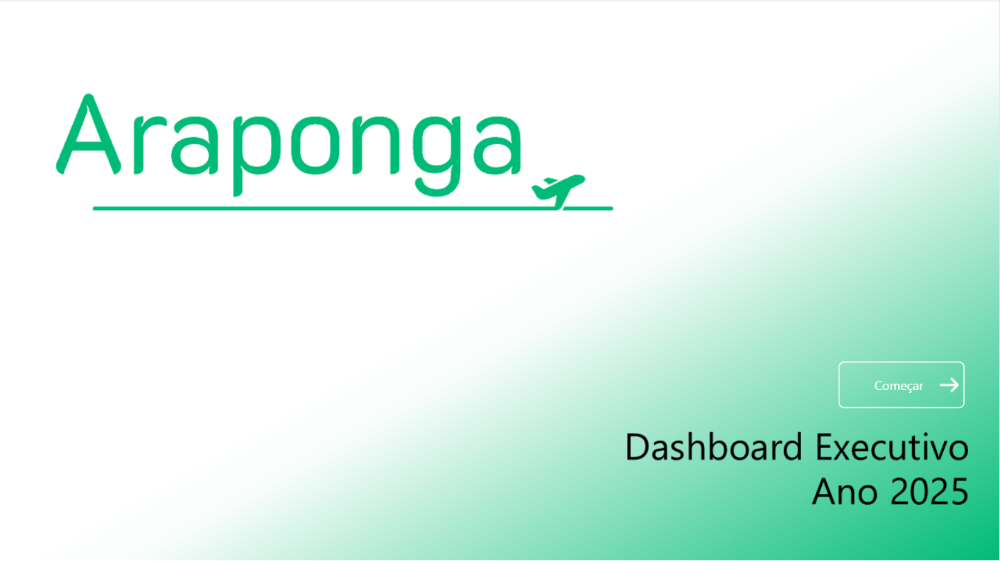
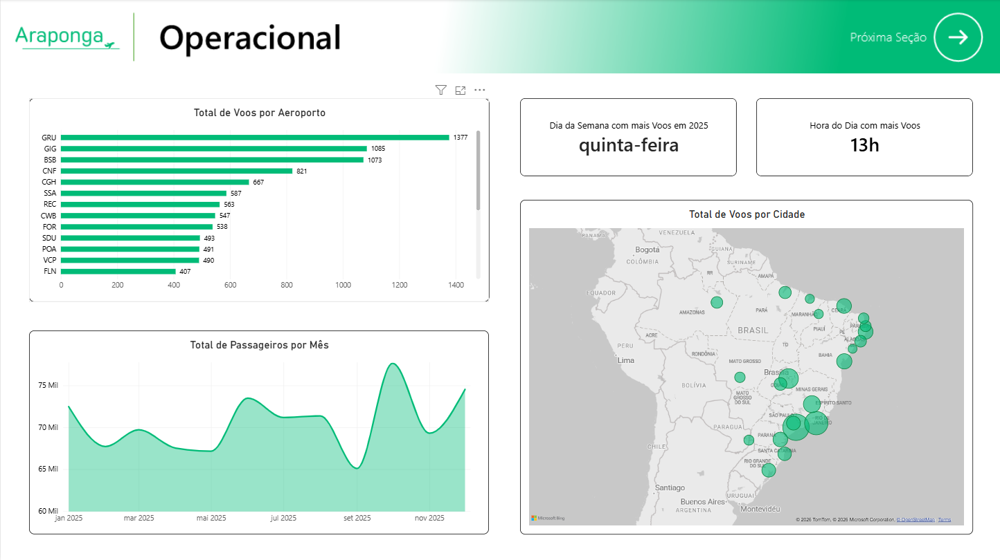
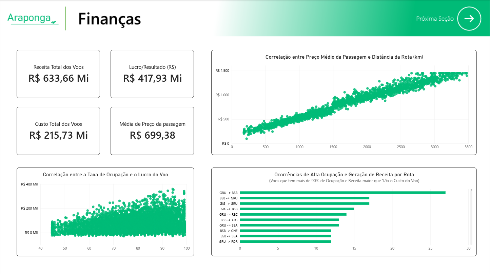
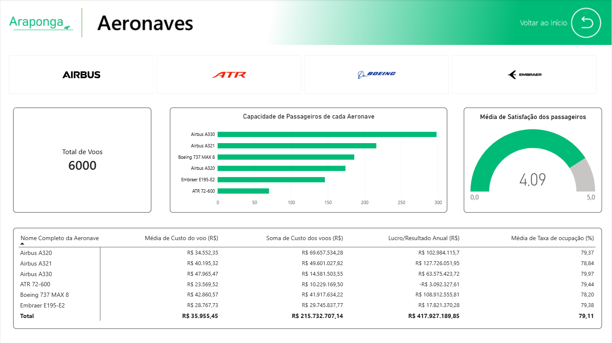

    <h1>Dashboard Executivo - Araponga Linhas Aéreas</h1>
     
    </img>

 
 

### ⁉️ O que é?
Relatório Executivo com Dashboards em Power BI para uma companhia aérea Brasileira fictícia (no meu caso, a Araponga). Essa atividade avalaitiva é da disciplina de Visualização de Dados, e seus requisitos estão no arquivo "[2B Exercício Prático – Visualização de Dados.pdf](https://github.com/gabriellima-4/Dashboard-Executivo-Araponga/blob/main/2B%20Exerci%CC%81cio%20Pra%CC%81tico%20%E2%80%93%20Visualizac%CC%A7a%CC%83o%20de%20Dados.pdf)".

### 🧠 O que foi feito?
- Geração de Dataset (em .xlsx) com IA;
- Planos de Fundo feitos no PowerPoint;
- Visuais e Análises respondendo questionamentos dos requisitos (ver seção 2 no pdf linkado acima);
- Medidas e Colunas Calculadas para os Visuais e Análises;
- Insights (seção 4 do pdf);
- Desmembramento do dataset original em tabelas fato e dimensão;
- Criação de botões de navegação entre os dashboards;

 
 

### 📄 Arquivo Principal do Repositório
    araponga-linhas-aereas.pbix

 

### 🔗 Relacionamentos entre Tabelas

    </img>

 
 

### 📊 Screenshots (versão enviada ao professor)

    </img>

    </img>
    </img>
    </img>

    </img>
    </img>
    </img>

 
 

### 🧑‍💻 Tecnologias Utilizadas

 
 
 

    <h2></h2>
    <h5>Desenvolvido por Gabriel Lima</h5>

